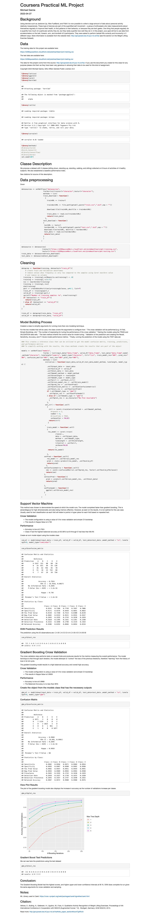

# practical-ml-wk4
Week 4 Project

## ATTENTION !!!
As stated in the assesment in coursera, you may need to download the HTML and view in a browser as github only displays native html. It will not compile and host HTML.

From Instructions:
"To evaluate the HTML file you may have to download the repo and open the compiled HTML document. 
Alternatively if they have submitted a repo with a gh-pages branch, you may be able to view the HTML page on the web...."

## Reproducibility

Due to security concerns with the exchange of R code, your code will not be run during the evaluation by your classmates. Please be sure that if they download the repo, they will be able to view the compiled HTML version of your analysis."

